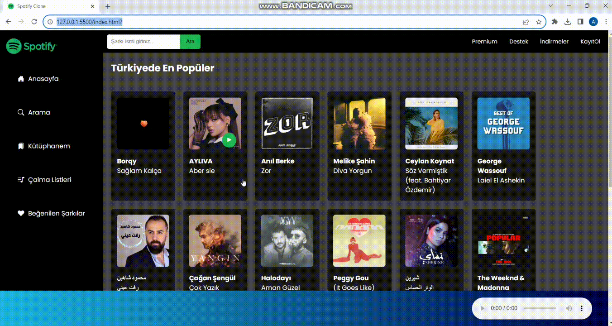

# USED TECHNOLOGIES 
- - HTML
- - CSS
- - JavaScript

# GOAL OF THE PROJECT 
- - In this project, it is aimed to clone the Spotify application with the music requests we have received from Api.

# SOURCES
- API: https://rapidapi.com/apidojo/api/shazam/
